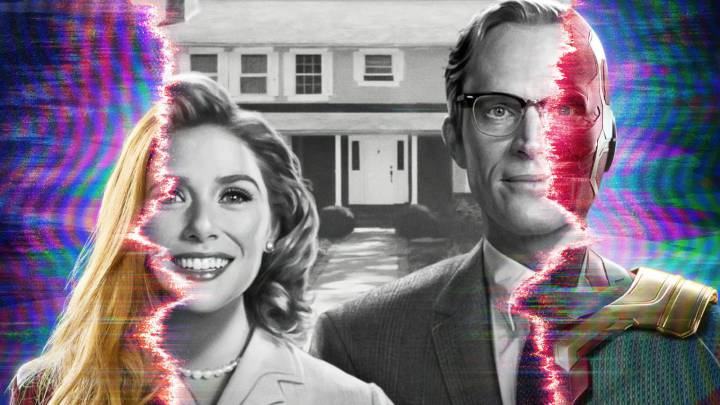
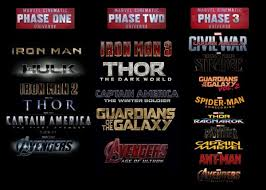
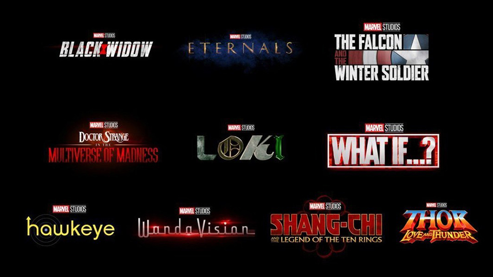

# Marvel*maníaco*
-----


##*Blog para fans del UCM y los comics*

### NOVEDADES Y ESTRENOS
----
#### WandaVisión
----
 
***Easter eggs y curiosidades***

El 15 de Enero de este año, la plataforma de contenido en streaming [***DisneyPlus***](http://www.disneyplus.com/es-es), <http://www.disneyplus.com/es-es>, estrenó la esperada serie sobre la humana *"mejorada"* Wanda Maximoff y el *"Sintetizoide"* de *Vibranium* Visión. Serie que aquí en España se denomina **Bruja Escarlata y Visión**, (como los conocemos en los comics), debido a un tema de ***Copyright***. 
Dicha serie se situa justo después de los eventos acontecidos en *Avengers**Endgame***, y nos sirve de preámbulo para introducirnos de lleno en la ***Fase4*** del UCM.

#### Sinopsis

WandaVision de Marvel Studios combina el estilo de «sitcom clásicas» con el Universo Cinematográfico de Marvel. Wanda Maximoff *(Elizabeth Olsen)* y Vision *(Paul Bettany)*, dos seres súper poderosos que viven sus vidas cotidianas ideales, comienzan a sospechar que no todo es como parece. En palabras de **Kevin Feige** productor de la serie:

> *Tenemos la oportunidad de contar su historia y mostrar más de lo que Wanda y Visión pueden hacer, y, lo más importante, que revele un nombre que ni siquiera estoy seguro de que hayamos dicho aún en el MCU, y será importante el hecho de que Wanda es la Bruja Escarlata. ¿Y qué significa eso, de que ella es la Bruja Escarlata? Con eso es con lo que jugamos con esta serie de formas completamente divertidas, algo aterradoras y que tendrán repercusiones para todo el futuro de la Fase 4 del UCM".*

```javascript
function test(){
	console.log("Hello world!");
}


```
---
#####¿De dónde venimos?

El seguidor más incondicional sabrá, de sobra, a estas alturas \"de la película", (nunca mejor dicho),qué es lo que ha acontecido hasta el momento, ahora que llega a nuestras pantallas la muy esperada "WandaVision" (título en su versión original). No obstante, para los que no hayan visulizado al menos dos o tres, de las 23 películas, (contando el film de Hulk de 2008 protagonizada por *Edaward Norton*) del UCM estrenadas hasta el momento, difícilmente podrán orientarse y entender, el porqué de muchos de los echos y situaciones narradas en esta nueva serie.

Para hacernos una idea más exacta del ^*Dónde*, listaremos por orden cronológico todas las producciones vistas hasta el momento:
1. Capitán América: El primer vengador (2011)



#####¿Hacia dónde vamos?

Como ya hemos dicho, Wanda visión sirve de pistoletazo de salida para la *FASE4*. ¿Pero que es la *fase 4*? Muy sencillo, es la nueva etapa establecida después de los echos narrados en **Vengadores End Game**, y en **Spiderman lejos de casa**, ambas las últimas producciones de la *FASE3*



Tras los eventos de ***EndGame***, sabemos que en principio y salvo sorpresa no contaremos más con la presencia de *Tony Stark*, (Iron man), que tras arrebatarle a *Thanos* las **Gemas del infinito** en el último instante, (antes de que éste chasquee los dedos de nuevo), experimentando su inmeso poder y logrando con su último aliento hacer el movimiento de dedos mencionado; consiguiendo así la desaparición de Thanos y todo su ejército, (para siempre en ésta ocasión). Pero con el resultado final de la muerte del /"héroe de brillante armadura".

También, (y a la espera de saber en que época transcurre la trama de *Black Widow*), sabemos que *Natasha Romanov* no aparecerá más en próximas producciones, obviando la ya mencionada película sobre su historia personal.

Pero también habíamos podido comprobar que *Visión* nos había dejado para siempre tras los eventos narrados en *Infinity War*, y sin embargo lo vemos como co-protagonista en **Bruja Escarlata y Visión**. Por tanto podemos esperar futuras sorpresas y quién sabe ¿regresos inesperados?

##### Estrenos en el horizonte próximo...
---
Éstos son algunos de los estrenos para los próximos meses:
- Bruja Escarlata y Visión (WANDAVISION) (15 DE ENERO)
- Falcon y el Soldado de Invierno (19 DE MARZO)
	- Escrita por *Malcolm Spellman* y dirigida por *Kari Skogland*, la serie continúa con los eventos de **Vengadores: Endgame**, con *Falcon* ejerciendo de heredero del Capitán *Steve Rogers*, portando su escudo.
- Viuda Negra (7 DE MAYO)
- LOKI (11 DE JUNIO)
	- En junio o julio se espera que regrese el maestro del engaño y máxima deidad en dicha materia, en forma de serie en Disney+. *Tom Hiddleston* vuelve como **Loki** y narrará sus aventuras a través del tiempo tras "esfurmarse" con el Tesseracto en *Vengadores: Endgame*.
- Shang-Chi and the Legend of the Ten Rings (9 DE JULIO)
- WHAT IF...? (MEDIADOS DE 2021)
- Los Eternos (5 DE NOVIEMBRE)
- Hawkeye (FINALES DE 2021)


